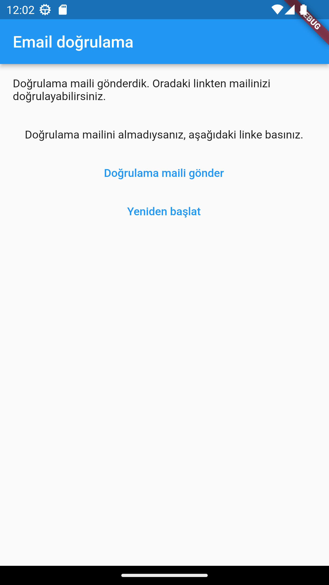
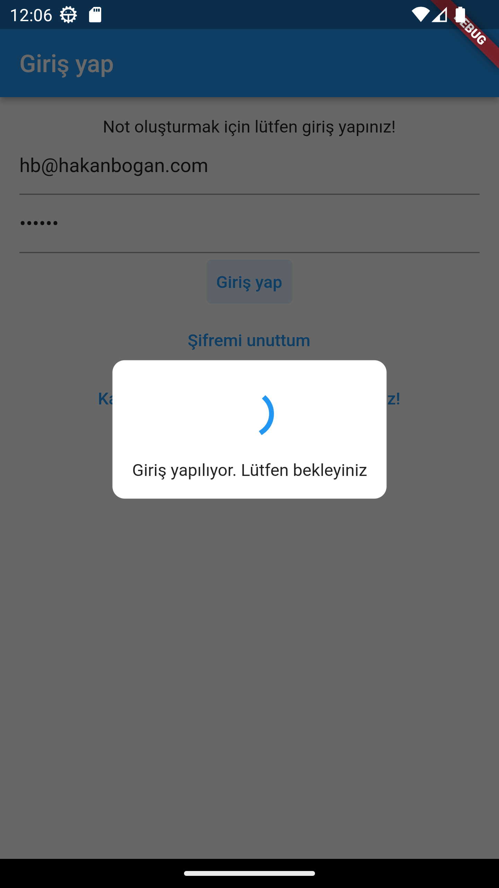
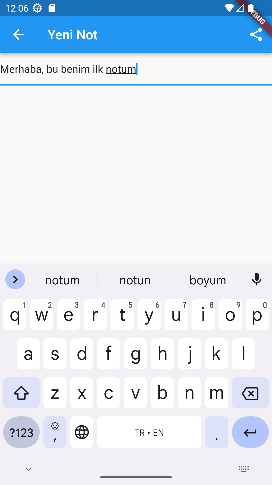
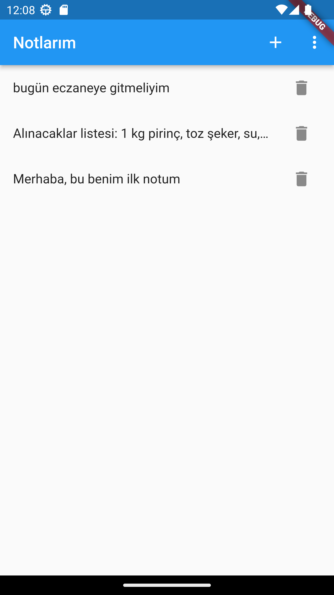

# MyNotes - Personal Note Taking App

MyNotes is a mobile application for taking personal notes. With MyNotes, users can create an account, save, edit and delete their notes. The app also supports user authentication and verification.

## Features
- User authentication
- Email verification
- Create, update and delete notes
- Forgot password functionality
- Authentication and Database operations are Firebase integrated.

<a href="assets/readme/main_page.png"></a>
<a href="assets/readme/verify_email.png"></a>
<a href="assets/readme/loading.png"></a>
<a href="assets/readme/create_note.png"></a>
<a href="assets/readme/notes_list.png"></a>

## Getting Started
To get started with MyNotes, clone the repository to your local machine and open the project in Android Studio.

```git clone https://github.com/redrussianarmy/my-notes-app.git```

## Prerequisites
- Android Studio
- Flutter SDK
- Dart SDK

## Installing
1. Open the project in Android Studio or Visual Studio Code.
2. Run the `pub get` command to download the required packages.
3. Set up a Firebase project and add the `google-services.json` file to the app.
4. Build and run the app.

## Built With
- [Flutter](https://flutter.dev) - The mobile app SDK used
- [Firebase](https://firebase.google.com) - The backend used for authentication and data storage

## Authors
John Doe - johndoe